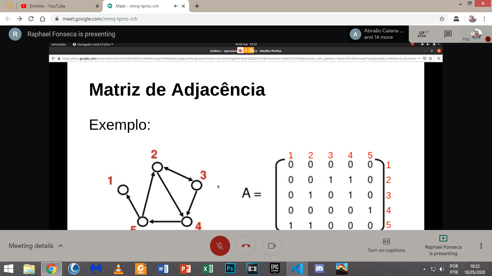

Grafo: estrutura que representa graficamente as relações entre elementos
   - Composto por:
      - Arestas: setas que marcam as relações
      - Vértices: nós do grafo
   - Grafo conectado: existe um caminho de qualquer vértice para qualquer outro
   - Grafo desconectado: nem todos os vértices podem ser alcançados de determindado vértice
   - Grafo direcional: quando as arestas são de relação mútua (<->)
   - Grafo não direcional: quando as arestas indicam uma relação unidirecional (<-- ou -->)

Número máximo de arestas em um grafo:
   a = C (n, 2)
   a: número de arestas | C: combinação | n: número de vértices

Matriz de Adjacência:

[Introduction to Graph Theory](https://medium.com/basecs/a-gentle-introduction-to-graph-theory-77969829ead8)

[Trees](https://medium.com/basecs/how-to-not-be-stumped-by-trees-5f36208f68a7)
